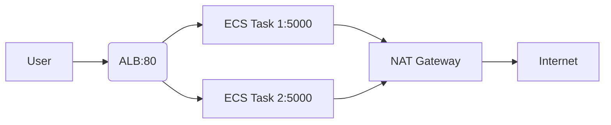

We are creating a secure and scalable AWS environment to host a containerized application using Amazon ECS (Elastic Container Service). The setup includes a Virtual Private Cloud (VPC) with multiple subnets, an ECS cluster, and a public-facing Load Balancer. Here's how it works:

## 🔸 VPC and Subnets
You begin by creating a VPC that contains two public subnets and two private subnets, each distributed across different availability zones for high availability.

Public subnets are configured with access to the internet via an Internet Gateway. These are used for components that need to be publicly accessible, such as the load balancer.

Private subnets do not have direct internet access. They are used to host internal resources, such as ECS tasks, to enhance security.

## 🔸 ECS Cluster and Tasks
An ECS cluster is then deployed within the VPC. This cluster manages the containerized application workloads.

An ECS service is created to run your container.

The service is associated with a task definition, which specifies the container image, resource requirements, networking settings, and more.

The ECS tasks are configured to run only in the private subnets, ensuring that they are not exposed directly to the internet.

## 🔸 Load Balancer
To make the application accessible to users:

An Application Load Balancer (ALB) is deployed in the public subnets.

The ALB receives traffic from the internet and routes it to ECS tasks running in the private subnets via a target group.

This way, the containers remain private, but the application is still accessible through the load balancer.

## 🔸 Traffic Flow Summary
The traffic flow is as follows:

Internet → Load Balancer (in public subnets) → Target Group → ECS Tasks (in private subnets)

## ✅ Benefits of This Setup
Security: Containers are protected in private subnets.

Scalability: ECS can automatically scale your services.

High Availability: Resources span multiple availability zones.

Best Practice: Follows AWS-recommended architecture for production workloads.


# AWS ECS Flask Deployment with Terraform

Terraform configuration to deploy a Flask application (`welkinoid/flasky2`) on AWS ECS with:
- VPC with public/private subnets
- Application Load Balancer (ALB)
- Fargate tasks in private subnets
- CloudWatch logging

## 📁 File Structure

```
terraform/
├── main.tf # Provider and core configuration
├── variables.tf # Input variables
├── outputs.tf # Output values
├── vpc.tf # VPC, subnets, routing
├── ecs.tf # ECS cluster, task definition, service
├── alb.tf # Load balancer resources
├── security.tf # Security groups and IAM roles
└── logs.tf # CloudWatch log group
```

## 🌐 Network Architecture

| Component          | Configuration Details                          | Purpose                          |
|--------------------|-----------------------------------------------|-----------------------------------|
| **VPC**            | `10.0.0.0/16` with DNS support                | Isolated network environment      |
| **Public Subnets** | 2 AZs (`10.0.1.0/24`, `10.0.2.0/24`)          | Hosts ALB                         |
| **Private Subnets**| 2 AZs (`10.0.3.0/24`, `10.0.4.0/24`)          | Hosts ECS tasks                   |
| **NAT Gateways**   | 1 per public subnet                           | Outbound internet for private SN  |

## 🛡️ Security

```hcl
# ALB Security Group (security.tf)
ingress {
  from_port   = 80
  to_port     = 80
  protocol    = "tcp"
  cidr_blocks = ["0.0.0.0/0"] # Public access
}

# ECS Security Group (security.tf)
ingress {
  from_port       = 5000
  to_port         = 5000
  protocol        = "tcp"
  security_groups = [aws_security_group.alb.id] # Only ALB access
}
```

## 🐳 ECS Configuration

Resource	  Settings
Cluster	    Fargate with Container Insights
Task      	0.25vCPU / 0.5GB RAM
Container	  welkinoid/flasky2 on port 5000
Scaling	    Fixed 2 tasks (adjust in ecs.tf)


## 🔄 Traffic Flow



# 🚀 Deployment

```bash

# Initialize
terraform init

# Preview changes
terraform plan

# Deploy
terraform apply

# Get ALB URL
terraform output alb_dns_name
```

## 🧹 Cleanup
```bash
terraform destroy
```

## ⚙️ Customization
Environment Variables: Add to container_definitions in ecs.tf

```hcl
environment = [
  { name = "FLASK_ENV", value = "production" }
]
```
HTTPS: Add ACM certificate + listener in alb.tf

Autoscaling: Add aws_appautoscaling_target resource

## 📌 Note:
Costs may vary based on region and usage. Monitor via AWS Cost Explorer.
